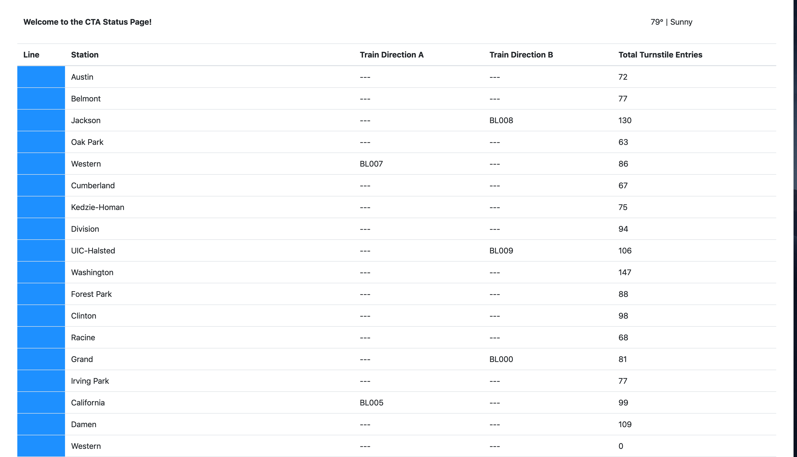

# Public Transit Status with Apache Kafka

This application illustrates the creation of a streaming event pipeline around Apache Kafka and its ecosystem tools like REST Proxy and Kafka Connect, created as part of the course Data Ingestion with Kafka & Kafka Streaming.
 
Using public data from the [Chicago Transit Authority](https://www.transitchicago.com/data/) an event pipeline around Kafka has been created in order to simulate and display the status of train lines in real time.

## Architecture
The architecture looks like so:


## Prerequisites

The following are required to run the application:

* Docker
* Python 3.7

## Quickstart

To run the simulation, you must first start up the Kafka ecosystem using Docker Compose.

```%> docker-compose up```

Once docker-compose is ready, the following services will be available:

| Service | Host URL | Docker URL | Username | Password |
| --- | --- | --- | --- | --- |
| Public Transit Status | [http://localhost:8888](http://localhost:8888) | n/a | ||
| Landoop Kafka Connect UI | [http://localhost:8084](http://localhost:8084) | http://connect-ui:8084 |
| Landoop Kafka Topics UI | [http://localhost:8085](http://localhost:8085) | http://topics-ui:8085 |
| Landoop Schema Registry UI | [http://localhost:8086](http://localhost:8086) | http://schema-registry-ui:8086 |
| Kafka | PLAINTEXT://localhost:9092,PLAINTEXT://localhost:9093,PLAINTEXT://localhost:9094 | PLAINTEXT://kafka0:9092,PLAINTEXT://kafka1:9093,PLAINTEXT://kafka2:9094 |
| REST Proxy | [http://localhost:8082](http://localhost:8082/) | http://rest-proxy:8082/ |
| Schema Registry | [http://localhost:8081](http://localhost:8081/ ) | http://schema-registry:8081/ |
| Kafka Connect | [http://localhost:8083](http://localhost:8083) | http://kafka-connect:8083 |
| KSQL | [http://localhost:8088](http://localhost:8088) | http://ksql:8088 |
| PostgreSQL | `jdbc:postgresql://localhost:5432/cta` | `jdbc:postgresql://postgres:5432/cta` | `cta_admin` | `chicago` |

Note that to access these services from your own machine, you will always use the `Host URL` column.

When configuring services that run within Docker Compose, like **Kafka Connect you must use the Docker URL**. When you configure the JDBC Source Kafka Connector, for example, you will want to use the value from the `Docker URL` column.

### Running the Application

To run the application it is important that you open a terminal window for each piece and run them at the same time. **If you do not run both the producer and consumer at the same time you will not be able to successfully run the application**.

#### To run the `producer`:

1. `cd producers`
2. `virtualenv venv`
3. `. venv/bin/activate`
4. `pip install -r requirements.txt`
5. `python simulation.py`

#### To run the Faust Stream Processing Application:
1. `cd consumers`
2. `virtualenv venv`
3. `. venv/bin/activate`
4. `pip install -r requirements.txt`
5. `faust -A faust_stream worker -l info`


#### To run the KSQL Creation Script:
1. `cd consumers`
2. `virtualenv venv`
3. `. venv/bin/activate`
4. `pip install -r requirements.txt`
5. `python ksql.py`

#### To run the `consumer`:

** NOTE **: Do not run the consumer until you have reached Step 6!
1. `cd consumers`
2. `virtualenv venv`
3. `. venv/bin/activate`
4. `pip install -r requirements.txt`
5. `python server.py`


To view the Transit Status Page, you need to open a web browser to http://localhost:8888

